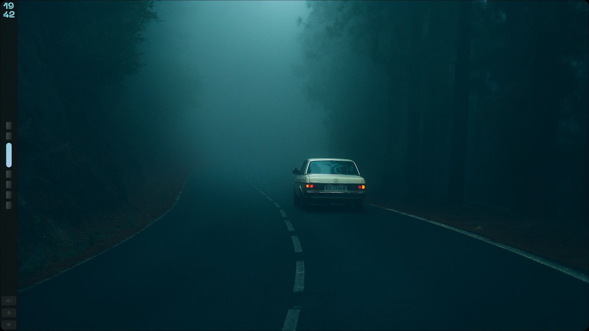

<div align="center">

# 【 HyprZepyx Project 】

A powerful, visually stunning Hyprland configuration built for **speed, workflow efficiency, and aesthetics**.

<p>
  
  &nbsp;
  
  &nbsp;
  
  &nbsp;
  
</p>

>  Our Website → [https://hyprzepyx.info.gf](https://hyprzepyx.info.gf)

</div>

---

## Project Overview

**HyprZepyx** is more than a configuration — it’s my personal vision. Designed for **developers and Linux enthusiasts**, it merges **aesthetic appeal** with **practical functionality**.

---

## Maintainer & Project Info

* **Maintainer:** xZepyx
* **Contact:** [zepyxunderscore@gmail.com](mailto:zepyxunderscore@gmail.com)
* **Project Duration:** 2025–2027 (legacy)
* **First created:** July 20th 2025

### Latest Updates

* Added new theme **Quiet-Fracture** | Best theme so far
* Adaptive color schemes
* New **Waybar themes** with adaptive colors
* Integrated **`Alt + A` command** for quick changes

---

# Screenshots & Visuals

## Quiet-Fracture

> Widget system: None | Support: Yes

| Desktop                                          | Launcher                                           |
| ------------------------------------------------ | -------------------------------------------------- |
|  |  |

| Wallpaper Menu                             | Swaync                                          |
| ------------------------------------------ | ----------------------------------------------- |
|  |  |

## Kernel-Fault<sup>ignis</sup>

> Widget system: ignis | Support: Yes

| Widgets                                        | Launcher                                         |
| ---------------------------------------------- | ------------------------------------------------ |
|  |  |

| ControlCenter                          | Kitty                                        |
| -------------------------------------- | -------------------------------------------- |
|  |  |

**Note:** Adjust paths in scripts if you have a custom setup.

---

## Recommended Setup

* **GTK Theme:** Dark minimalist themes for best visuals
* **Fonts:** FiraCode, JetBrainsMono, or any monospaced font
* **Icons:** Papirus, Tela, or flat icon packs
* **Terminal Colors:** Solarized Dark or Gruvbox

> Each app is **optimized for performance and minimal resource usage**.

---

## Installation Guide

1. Clone repository

```bash
git clone https://github.com/xZepyx/HyprZepyx.git ~/hyprzepyx
cd ~/hyprzepyx
```

2. Install dependencies

```bash
bash deps-installer.sh # (prerequisites script is now deprecated)
```

3. Copy configs

```bash
# Manual step
```

4. Launch Hyprland

```bash
hyprland
```

---

> 🖼️ Wallpapers: [Wallbank](https://github.com/xZepyx/Wallbank)

---

## Troubleshooting

* Waybar icons missing → Install FontAwesome or Material Icons
* Eww widgets missing → Run `eww daemon` before Hyprland
* Rofi launcher errors → Check `rofi/config.rasi` paths
* Hyprland crashes → Inspect `~/.local/share/hyprland.log`

---

## Old Stuff

### Spectral-Horizon (quickshell)

> Widget system: quickshell | Support: ❌

| Widgets                                            | Launcher                                             |
| -------------------------------------------------- | ---------------------------------------------------- |
|  |  |

| Wallpaper Menu                               | Desktop                                            |
| -------------------------------------------- | -------------------------------------------------- |
|  |  |

### Abyss (eww)

> Widget system: eww | Support: Legacy

| Code Editor                       | Lockscreen                                |
| --------------------------------- | ----------------------------------------- |
|  |  |

| Wallpaper Switcher                                  | Eww Minimal                                     |
| --------------------------------------------------- | ----------------------------------------------- |
|  |  |

### Lumen (glossy)

> Widget system: none | Support: ❌

| Desktop                                 | Lockscreen                                |
| --------------------------------------- | ----------------------------------------- |
|  |  |

| Rofi Apps                                 | Terminal                                  |
| ----------------------------------------- | ----------------------------------------- |
|  |  |

---

## Todo

* Replace Wofi with Walker (planned)
* Improved Wallpaper Switcher
* Provide installation script
* Separate dependencies by theme

---

## Special Thanks

* [Hyprland](https://github.com/hyprwm/hyprland)
* [Quickshell](https://github.com/quickshell-mirror/quickshell)
* [Ignis Project](https://github.com/ignis-sh/ignis)
* [Rofi](https://github.com/davatorium/rofi)
* [Eww](https://elkowar.github.io/eww/)
* [Waybar](https://github.com/Alexays/Waybar)

> **Spectral-Horizon theme** is a fork of end4 dotfiles which removes AI and other unwanted stuff from it. 

---

## Issues

> All of the items below should be checked and submitted to a issue

#### Step 1. Before you submit

 *   I have read the Troubleshooting and Usage pages.
 *  I've successfully updated to the latest version following the guidance.
 *  I've successfully updated the system packages to the latest.
    
####  Step 2. Quick diagnose info

####  Step 3. Describe the issue


---

## License

© 2025–2040 xZepyx (Aditya Yadav) [zepyxunderscore@gmail.com](mailto:zepyxunderscore@gmail.com)
Licensed under **GNU GPLv3** — free to use, modify, and redistribute.
