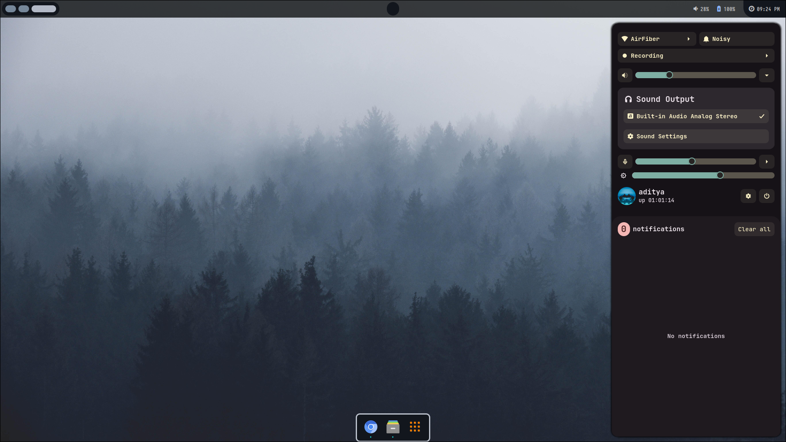

  <h1>【 HyprZepyx Project 】</h1>

  

---

  <h2>• Overview •</h2>

A **minimal yet functional** Hyprland configuration focused on speed, clarity, and aesthetics.  
Designed and maintained by **xZepyx**.  

> ⚡ **Note:** This setup is tailored for personal use. Some paths or scripts may require adjustments.  
> 📦 To use the **kernel-fault** theme, install the required packages listed in [`requirements-ignis.txt`](config/kernel-fault/ignis/requirments-ignis.txt).  
> 🎨 For best visuals, ensure proper GTK themes and fonts are installed.  

---

  
<b>Keybindings</b>

| Combo           | Action                                |
|-----------------|---------------------------------------|
| `Super + Enter` | Launch Kitty Terminal                 |
| `Super + C`     | Kill focused window                   |
| `Super + M`     | Exit Hyprland session                 |
| `Super + E`     | Open file manager (Nautilus)          |
| `Super + V`     | Toggle floating window                |
| `Super + D`     | Open Rofi app launcher                |
| `Super + Q`     | Open power menu                       |
| `Super + P`     | Toggle pseudotiling                   |
| `Super + J`     | Toggle split mode                     |
| `Super + Space` | Toggle fullscreen                     |
| `Super + B`     | Open wallpaper switcher               |
| `Super + W`     | Launch Firefox                        |
| `Super + F`     | Launch text editor                    |
| `Alt + L`       | Lock screen (Hyprlock)                |
| `Alt + D`       | Region screenshot (grim+slurp)        |

**Workspace controls:**  
- `Super + [1-0]` → Switch workspaces  
- `Super + Shift + [1-0]` → Move window to workspace  
- `Super + Arrow Keys` → Move focus  
- `Super + Mouse Wheel` → Cycle workspaces  

**Mouse binds:**  
- `Super + Left Click` → Move window  
- `Super + Right Click` → Resize window  

**Media / Volume / Brightness:**  
- `XF86AudioRaiseVolume` → Volume +5%  
- `XF86AudioLowerVolume` → Volume -5%  
- `XF86AudioMute` → Toggle mute  
- `XF86AudioMicMute` → Toggle mic mute  
- `XF86MonBrightnessUp/Down` → Brightness ±5%  
- `XF86AudioNext/Prev/Play/Pause` → Media control  

  
<b>Autostarted Apps</b>

- `kitty` — Terminal  
- `waybar` — Status bar  
- `swww-daemon` — Wallpaper  
- `swaync` — Notifications  
- `eww` — Widgets  

---

  <h2>• Screenshots •</h2>

### kernel-faultignis — *“fatal exception: elegance”*  (a.k.a **Ignis Fault**)

Widget system: **Ignis** | Support: Yes

| Widgets | Launcher |
|:-------:|:--------:|
|  |  |
| *Widgets* | *Launcher (Ignis)* |

| Control Center | Terminal |
|:--------------:|:--------:|
|  |  |
| *Control Center* | *Terminal* |

---

### abysseww — *“stillness devours”*  

Widget system: **eww** | Support: Yes

| Code | Lockscreen |
|:----:|:----------:|
|  |  |
| *Code* | *Hyprlock* |

| Wallpaper Switcher | Eww Minimal |
|:-----------------:|:-----------:|
|  |  |
| *Rofi (Wall)* | *Eww Minimal* |

---

### lumenglossy — *“shadows made visible.”*  

Widget system: **None** | Support: No (Dead)  

| Desktop | Lockscreen |
|:-------:|:----------:|
|  |  |
| *Idle Desktop* | *Hyprlock* |

| Rofi Apps | Terminal |
|:---------:|:--------:|
|  |  |
| *App Launcher* | *Terminal Layout* |

---

  <h2>• Acknowledgments •</h2>

- [Hyprland](https://github.com/hyprwm/hyprland)
- [Ignis Project](https://github.com/ignis-sh/ignis)
- [Rofi](https://github.com/davatorium/rofi)
- [Eww](https://elkowar.github.io/eww/)  
- [Waybar Project](https://github.com/Alexays/Waybar)  

---

  <h2>• License •</h2>

© 2025–2040 Aditya Yadav <zepyxunderscore@gmail.com>  
Licensed under **GNU GPLv3** — free to use, modify, and redistribute.  

---

  <h2>• Final note •</h2>

This configuration is all about **clean visuals** and **fast workflows**.  
Tweak it, remix it, or use it as a base for your own setup.  
✨ Happy customizing! ✨

