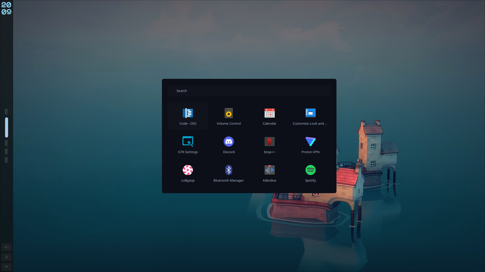
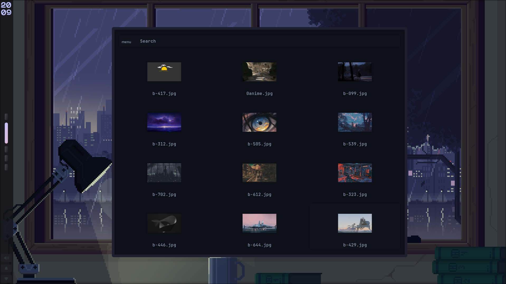
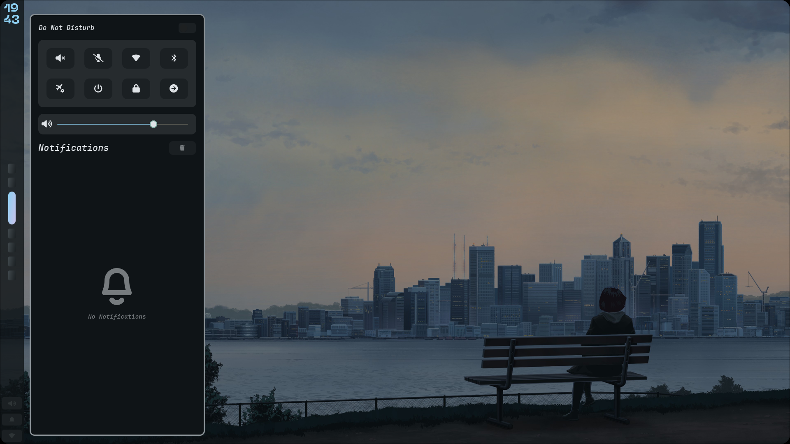
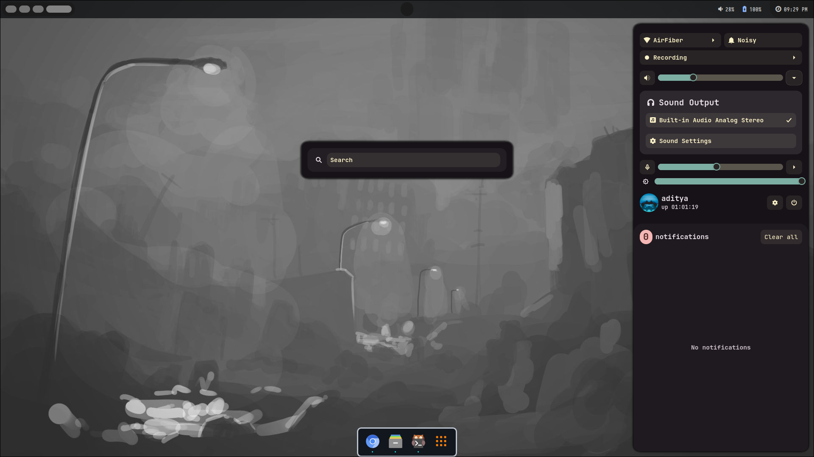
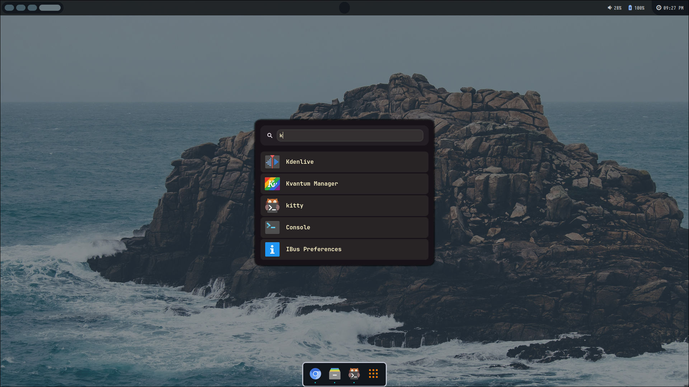
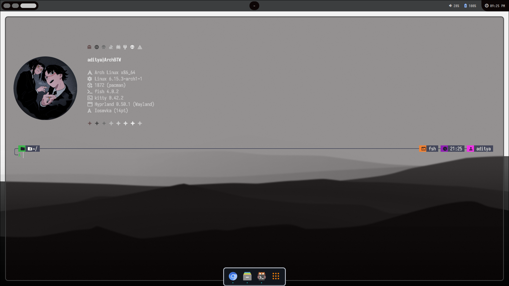
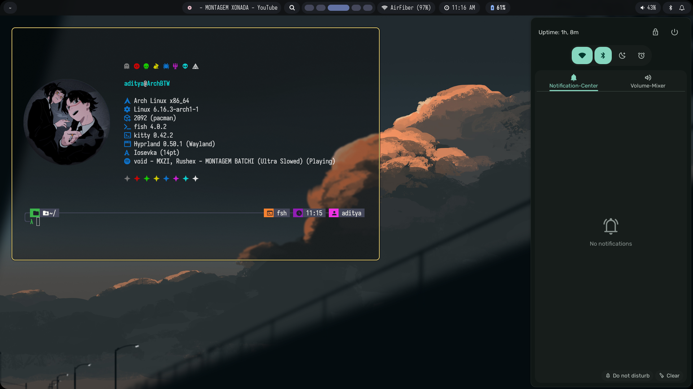
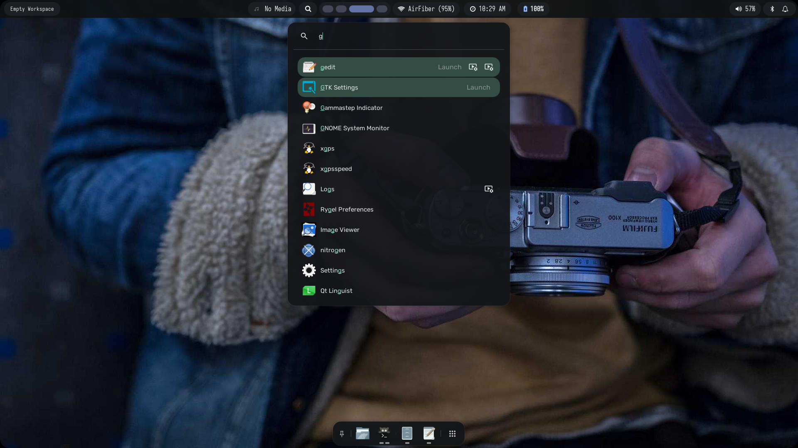
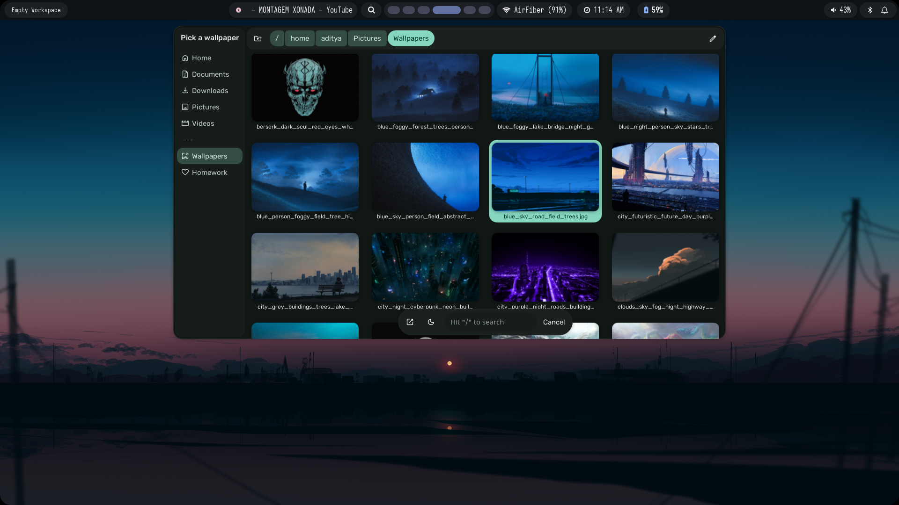
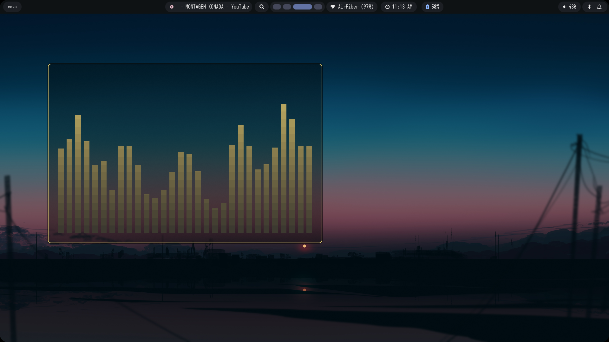

<div align="center">


# 【 HyprZepyx Project 】


A powerful, visually stunning Hyprland configuration built for **speed, workflow efficiency, and aesthetics**.


> Our Website [https://hyprzepyx.info.gf]

</div>
---

## Project Overview

**HyprZepyx** is more than a configuration — in my opinion for me. Designed for **developers, and Linux enthusiasts**, it merges **aesthetic appeal** with **practical functionality**.

---

## Maintainer & Project Info

- **Maintainer:** xZepyx
- **Contact:** zepyxunderscore@gmail.com
- **Project Duration:** 2025–2040 (ongoing development)

### Latest Updates

- Added new theme **Quiet-Fracture** | Best theme so far.
- Adaptive color shemes
- Added new **Waybar themes** with adaptive colors
- Integrated **`Alt + A` command** for change


---

# Screenshots & Visuals


## Quiet-Fracture
> Widget system: None | Support: Yes

| Desktop | Launcher |
|---------|---------|
|  |  |
| Desktop | Launcher (Rofi) |

| Wallpaper Menu | Swaync |
|----------------|---------|
|  |  |
| Wallpaper Menu | Swaync |


## Kernel-Fault<sup>ignis</sup>
> Widget system: ignis | Support: Yes

| Widgets | Launcher |
|---------|---------|
|  |  |
| Widgets Overview | Launcher (Ignis) |

| ControlCenter | Kitty |
|----------------|---------|
|  |  |
| ControlCenter | Kitty |

**Note:** Adjust paths in scripts if you have a custom setup.

---

## Recommended Setup

- **GTK Theme:** Dark minimalist themes for best visuals
- **Fonts:** FiraCode, JetBrainsMono, or any monospaced font
- **Icons:** Papirus, Tela, or flat icon packs
- **Terminal Colors:** Solarized Dark or Gruvbox preferred
> Each app is **optimized for performance and minimal resource usage**.

---

## Installation Guide

1. Clone repository
```
git clone https://github.com/xZepyx/HyprZepyx.git ~/hyprzepyx
cd ~/hyprzepyx
```
2. Install dependencies
```
bash deps-installer.sh #(prerequities is now deprecated and removed.)
```
3. Copy configs
```
do it yourself i'm so tired of typing this now.
```
4. Launch Hyprland
```
hyprland
```

---

> Use these !!!!!!!!
- Wallpapers: 

---

## Troubleshooting

- Waybar icons missing: Install FontAwesome or Material Icons
- Eww widgets missing: Run `eww daemon` before Hyprland
- Rofi launcher errors: Check `rofi/config.rasi` paths
- Hyprland crashes: Check `~/.local/share/hyprland.log`

---

## Old Stuff

### Spectral-Horizon (quickshell)

| Widgets | Launcher |
|---------|---------|
|  |  |
| Widgets Overview | Launcher (QS) |

| Wallpaper Menu | Desktop |
|----------------|---------|
|  |  |
| Wallpaper Menu | Desktop |

### Abyss (eww)

| Code Editor | Lockscreen |
|------------|------------|
|  |  |
| VSCode Layout | Minimal Lock |

| Wallpaper Switcher | Eww Minimal |
|------------------|-------------|
|  |  |
| Rofi Wallpaper Manager | Minimal Widget Set |

### Lumen (glossy)

| Desktop | Lockscreen |
|---------|------------|
|  |  |
| Idle Desktop | Hyprlock |

| Rofi Apps | Terminal |
|-----------|---------|
|  |  |
| App Launcher | Terminal Layout |


---

## Special Thanks

- [Hyprland](https://github.com/hyprwm/hyprland) > It's insane
- [Quickshell](https://github.com/quickshell-mirror/quickshell)
- [Ignis Project](https://github.com/ignis-sh/ignis)
- [Rofi](https://github.com/davatorium/rofi)
- [Eww](https://elkowar.github.io/eww/)
- [Waybar](https://github.com/Alexays/Waybar)

> end'4 and soromane's dots for inspiration (spectral-horizon theme)

---

## License

© 2025–2040 xZepyx(Aditya Yadav) (zepyxunderscore@gmail.com)
Licensed under **GNU GPLv3** — free to use, modify, and redistribute.

---

