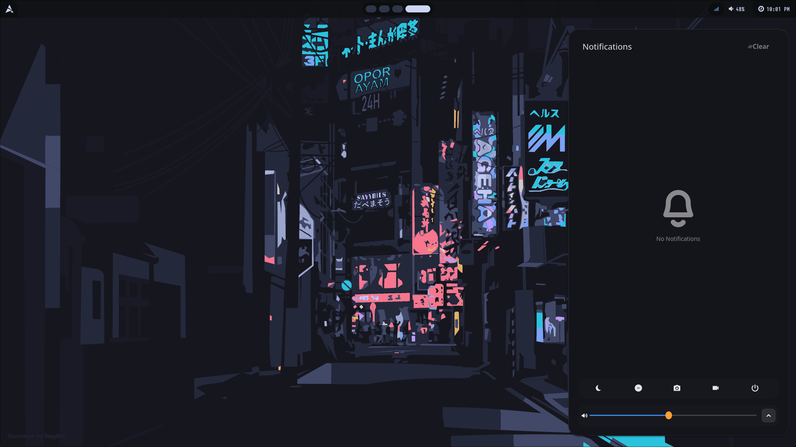

# Minimal Hyprland Configuration

A minimal yet functional Hyprland setup focused on speed, clarity, and aesthetics. 
Designed and maintained by **xZepyx**.

> This setup is tailored for personal use. Some paths or scripts may require adjustment based on your system.

> Update : New Theme Added. Soon Auto-Theme Switcher Coming!!

---

# Screenshots

> All images are located in the repository and referenced below.

## Abyss

### Code

### Hyprlock (Lockscreen)

### App Launcher (Rofi)

### Terminal Layout

### Wallpaper Switcher

### Waybar Layout

#### Notification Center

#### Eww Widgets

#### Eww Minimal

## Lumen

### Desktop (Idle)

### Hyprlock (Lockscreen)

### App Launcher (Rofi)

### Terminal Layout

### Waybar Layout

#### Notification Center

---

## Features

- **Minimal dwindle layout**
- **Kitty terminal**
- **Rofi launcher and powermenu**
- **Waybar for system info**
- **Wallpaper and lock screen integration**
- **Blur, shadows, and rounded corners**
- **Workspaces and multi-window support**
- **Media, volume, and brightness keybindings**

---

## Keybindings Overview

| Key Combo | Action |
|----------|--------|
| `Super + Enter` | Launch Kitty terminal |
| `Super + C` | Kill focused window |
| `Super + M` | Exit Hyprland session |
| `Super + E` | Open file manager (Nautilus) |
| `Super + V` | Toggle floating for current window |
| `Super + D` | Open app launcher (Rofi) |
| `Super + Q` | Open power menu |
| `Super + P` | Toggle pseudotiling |
| `Super + J` | Toggle split mode |
| `Super + Space` | Toggle fullscreen |
| `Super + B` | Open wallpaper switcher |
| `Super + W` | Launch web browser (Firefox) |
| `Super + F` | Launch text editor |
| `Alt + L` | Lock screen (Hyprlock) |
| `Alt + D` | Select region and screenshot with `grim` + `slurp` |

### Workspace Control

| Key Combo | Action |
|----------|--------|
| `Super + [1-0]` | Switch to workspace 1–10 |
| `Super + Shift + [1-0]` | Move active window to workspace 1–10 |
| `Super + Arrow Keys` | Move focus to other windows |
| `Super + Mouse Wheel` | Cycle through workspaces |

### Mouse Binds

| Mouse Combo | Action |
|-------------|--------|
| `Super + Left Click` | Move window |
| `Super + Right Click` | Resize window |

### Media / Volume / Brightness

| Key | Action |
|-----|--------|
| `XF86AudioRaiseVolume` | Volume +5% |
| `XF86AudioLowerVolume` | Volume -5% |
| `XF86AudioMute` | Toggle mute |
| `XF86AudioMicMute` | Toggle mic mute |
| `XF86MonBrightnessUp` | Brightness +5% |
| `XF86MonBrightnessDown` | Brightness -5% |
| `XF86AudioNext` | Next track (playerctl) |
| `XF86AudioPlay/Pause` | Toggle play/pause |
| `XF86AudioPrev` | Previous track |

---

## Autostart Applications

- `nm-applet` (network)
- `kitty` (terminal)
- `waybar` (status bar)
- `swww-daemon` (wallpaper)
- `swaync` (notifications)

---

## License

© 2025–2040 Aditya Yadav zepyxunderscore@gmail.com
Licensed under GNU-GPLv3.
You are free to copy, modify, and redistribute under the same license.

---

## Final Note

This configuration is designed for clean visuals and fast workflows

---

