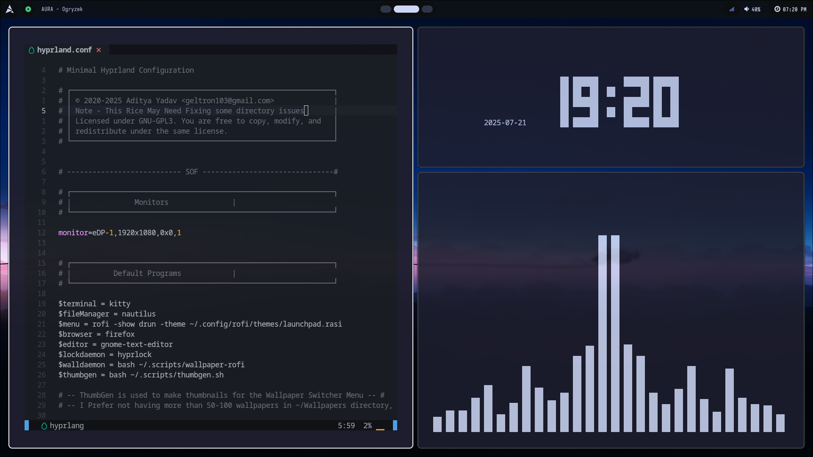
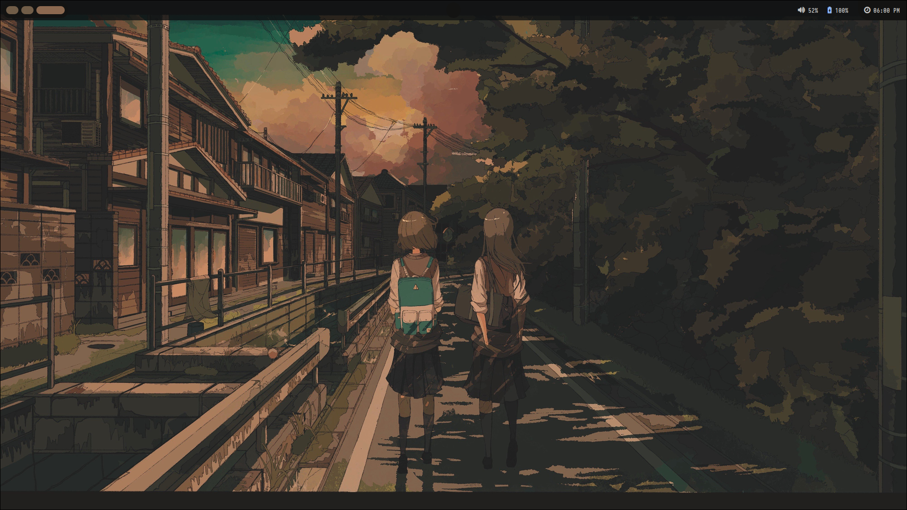
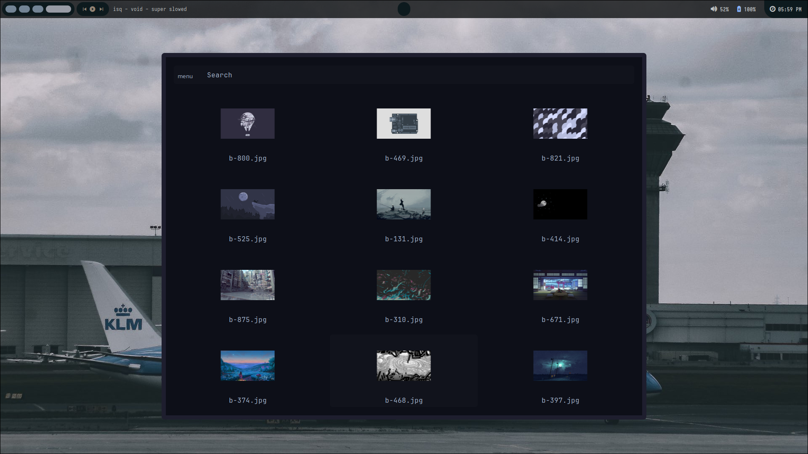
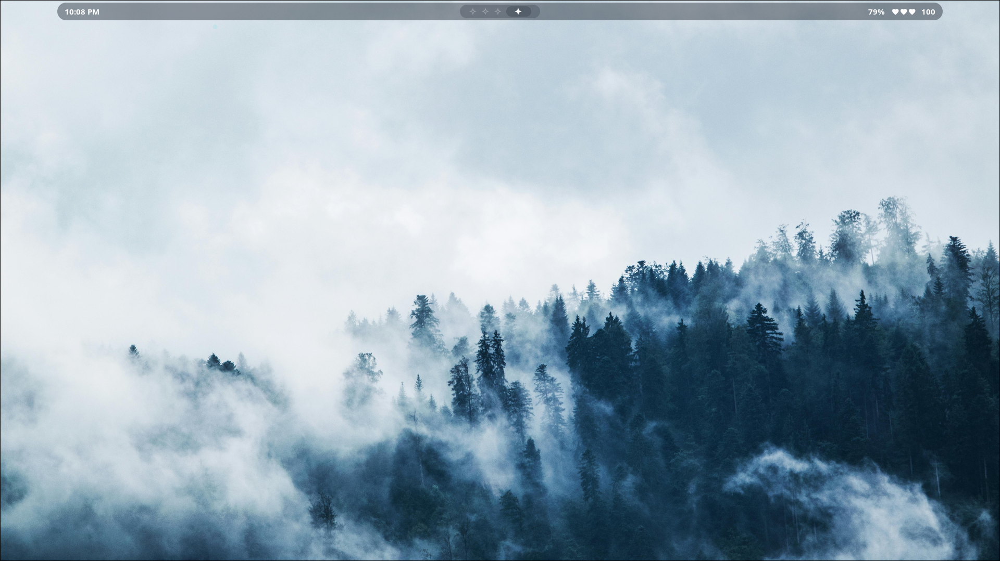
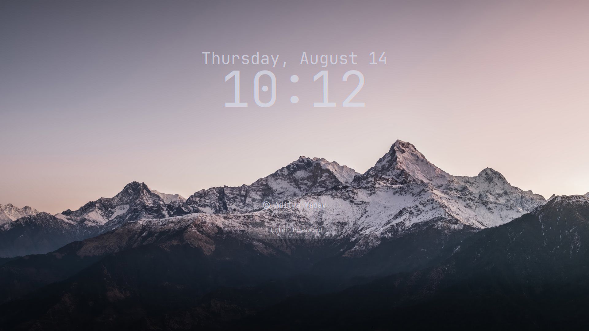
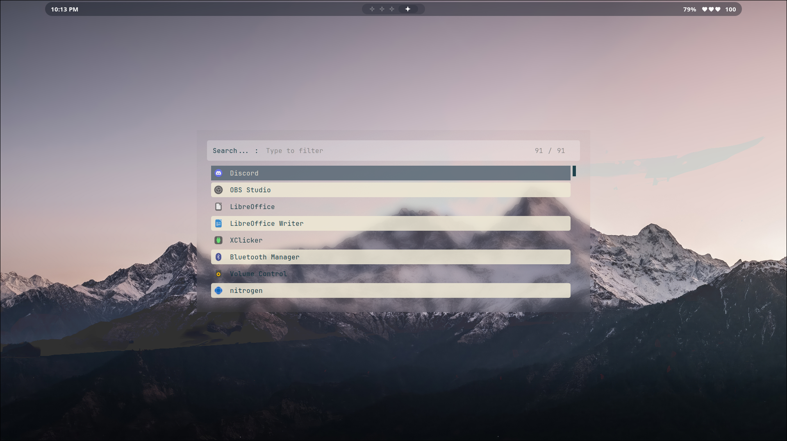
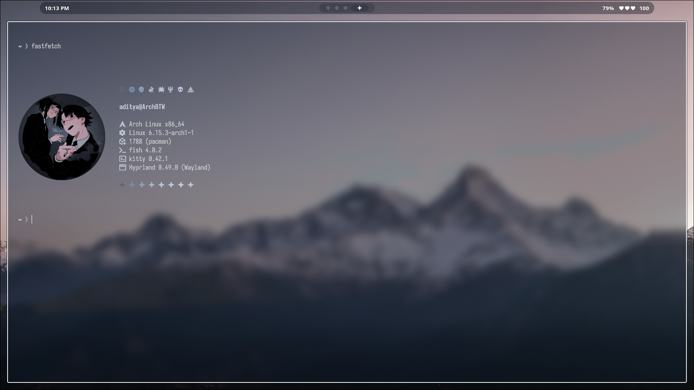

# HyprZepyx — Minimal, Fast, Aesthetic Hyprland Dotfiles

A **minimal yet functional** Hyprland configuration focused on speed, clarity, and aesthetics.  
Designed and maintained by **xZepyx**.

> **Note:** This setup is tailored for personal use. You may need to adjust some paths or scripts for your system.

---

> **Also**  You may need to get the right gtk and fonts to make this rice look way better, I'm currently working on adding some presets with automatic gtk configuring.

---

> 🆕 **Latest:** install.sh script added. (Not tested yet, use at your own risk)

---

##  Screenshots

_Abyss Theme:_
- **Code:**  
  
- **Hyprlock (Lockscreen):**  
  
- **App Launcher (Rofi):**  
  
- **Desktop Layout:**  
  
- **Wallpaper Switcher:**  
  
- **Waybar Layout:**  
  
- **Notification Center:**  
  
- **Eww Minimal:**  
  

---

_Lumen Theme:_
- **Desktop (Idle):**  
  
- **Hyprlock (Lockscreen):**  
  
- **App Launcher (Rofi):**  
  
- **Terminal Layout:**  
  
- **Waybar Layout:**  
  

---

## ✨ Features

- **Minimal dwindle layout (Hyprland)**
- **Kitty** terminal
- **Rofi** launcher & powermenu
- **Waybar** for system info
- **Integrated wallpaper/lock screen**
- **Blur, shadows & rounded corners**
- **Workspaces & multi-window support**
- **Media, volume & brightness keybinds**
- **Minimal Lighweight but usable with looks**

---

## ⌨️ Keybindings

| Combo                | Action                                     |
|----------------------|--------------------------------------------|
| `Super + Enter`      | Launch Kitty Terminal                      |
| `Super + C`          | Kill focused window                        |
| `Super + M`          | Exit Hyprland session                      |
| `Super + E`          | Open file manager (Nautilus)               |
| `Super + V`          | Toggle floating window                     |
| `Super + D`          | Open Rofi app launcher                     |
| `Super + Q`          | Open power menu                            |
| `Super + P`          | Toggle pseudotiling                        |
| `Super + J`          | Toggle split mode                          |
| `Super + Space`      | Toggle fullscreen                          |
| `Super + B`          | Open wallpaper switcher                    |
| `Super + W`          | Launch Firefox                             |
| `Super + F`          | Launch text editor                         |
| `Alt + L`            | Lock screen (Hyprlock)                     |
| `Alt + D`            | Region screenshot with grim+slurp          |

**Workspace controls:**  
- `Super + [1-0]`: Switch workspaces 1–10  
- `Super + Shift + [1-0]`: Move window to workspace  
- `Super + Arrow Keys`: Move focus  
- `Super + Mouse Wheel`: Cycle workspaces  

**Mouse binds:**  
- `Super + Left Click`: Move window  
- `Super + Right Click`: Resize window  

**Media/volume/brightness:**  
- `XF86AudioRaiseVolume`: Volume +5%  
- `XF86AudioLowerVolume`: Volume -5%  
- `XF86AudioMute`: Toggle mute  
- `XF86AudioMicMute`: Toggle mic mute  
- `XF86MonBrightnessUp/Down`: Brightness +/-5%  
- `XF86AudioNext/Prev/Play/Pause`: Media control

---

## 🚀 Autostarted Apps

- `kitty` (terminal)
- `waybar` (status bar)
- `swww-daemon` (wallpaper)
- `swaync` (notifications)
- `eww` (widgets)

---

## 📜 License

© 2025–2040 Aditya Yadav <zepyxunderscore@gmail.com>  
Licensed under **GNU GPLv3** — you are free to copy, modify, and redistribute under the same license.

---

## 💬 Final Note

This configuration is all about clean visuals and fast workflows.  
Tweak it, remix it, or use it as a base for your own setup.  
Happy customizing!

